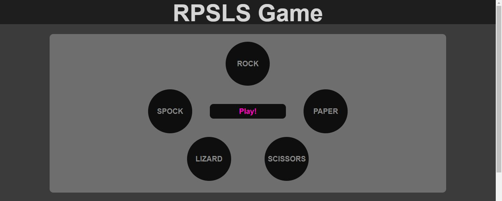

# RPSLS Game

RPSLS is a browser game that hopes to allow the user to play a game of Rock, Paper, Scissors against the computer, with two additional choices, so each choice beats two others and is itself beaten by two others, e.g Rock beats Scissors and Lizard, but is beaten by Paper and Spock. The site will be targeted toward people interested in playing a simple browser game and potentially trying to beat their high score. RPSLS will be useful if users want to waste some time and have fun playing a quick, easy-to-pick-up game.

## Features

### The game

First and foremost, RSPLS features the ability to play a guessing against the computer which increases in difficulty as you win - first at 3 wins and again at 6. 

### Score tracking

Along with the game itself, the script will track your current score, which will go up by 1 for a win and down by 1 for a loss. It will also track your highest score and the difficulty setting, which will either be Normal, Hard, or Impossible,depending on your number of wins.

### Screen size compatability

When styling the game, I worked towards a good mobile look first, then tablet, then desktop. This si known as the mobile-first approach.

## Credits

fix to a bug where my event listener's function would fire twice
https://stackoverflow.com/questions/36461855/javascript-click-event-firing-twice-even-with-stoppropagation/36462079

code to check which radiobutton is selected in Js
https://stackoverflow.com/questions/1423777/how-can-i-check-whether-a-radio-button-is-selected-with-javascript

code to vertically align a single line of text in a div, which I used for my choice buttons
https://stackoverflow.com/questions/2939914/how-do-i-vertically-align-text-in-a-div

code to change text color if the radio button is checked
https://www.codegrepper.com/code-examples/whatever/how+to+change+color+of+a+radio+button

## Testing

I kept a diary of sorts as I wrote the code for this website, available in diary.md. I wasn't intending to share it here but now believe it could be useful to see the steps I took to test, diagnose, and fix certain bugs. It's worth noting that I may not always detail my fix in the diary, but any bug I wrote about in there, I did fix.
diary: <a href="diary.md" about="_blank">Click here</a>

I tested inputs by selecting each choice and pressing play a number of times. This led me to discover that certain choices would win when they should not, e.g Spock winning against Lizard. At first, I believed this to be a problem with the function that declared the winner, but I later discovered a spelling error in some if()s, and was very relieved that it was a stupid error on my part and nothing more complicated.

I tested pressing play when no value is submitted, and found that the computer would play against you as if you had selected Rock. I believe this was because the way I tracked player selection was in a variable names Result, which I had declared outide of the function as result="";. Js read this as 0, which is what Result would equal when the player selected Rock. I fixed this by making result=null; before it's redeclared, and testing if it still equals null after the play button is pressed. If it did, this would mean no choice was selected, and the game would not run.

I tested resetting the difficulty at various points a number of times to see if it would let me keep my current score or change something in a way I wasn't expecting, though it never did. 

JavaScript validator produces no errors
<a href="https://beautifytools.com/javascript-validator.php" about="_blank">beautifytools.com/javascript-validator</a>

CSS validator produces no errors
<a href="https://jigsaw.w3.org/css-validator/validator" about="_blank">jigsaw.w3.org/css-validator</a>

HTML validator produces no errors
<a href="https://validator.w3.org/" about="_blank">validator.w3.org</a>

## Deployment

The site was deployed to GitHub pages. The steps I took to do this were:
1. In the GitHub repository page, click settings in the upper right
2. Scroll down to Pages and open the link
3. select the main branch in thr dropdown and click save
4. the page will refresh and the link to the deployed project will be available
The live link can be found here - <a href="https://jameslstudent.github.io/Milestone-Project-2/" target="_blank">Click me</a>

## What I'd do better

I am not happy with the vast if/else statements I had to write to check the player's input against the computer's. In fact, I did look around to see if there were better ways to do this, and did indeed find some much more efficient code, but I did not fully understand it and did not want to implement something I would not be able to maintain. Further, because this is an assessed project, I wanted the majority of the code written in it to be my own - after all, I'm demonstrating my abiity, not a user on Stack Overflow. However, if this were not an assessed project, I likely would have used their code, because I understand that reinventing the wheel is something to be avoided where possible. In future, I'd like to break the code they used down into pieces I could understand, so that I can make use of it myself.

I would also like to play with the difficulty more - potentially creating an easy mode where the computer will reroll if it wins and try to lose. I would also like to implement a system where difficulty can go back down depending on your number of wins or losses.

I would like to implement a way to bet tokens. For instance, you begin with 10, bet 5 and hit play, and if you win, you get double the amount back, but if you lose, you get nothing back.